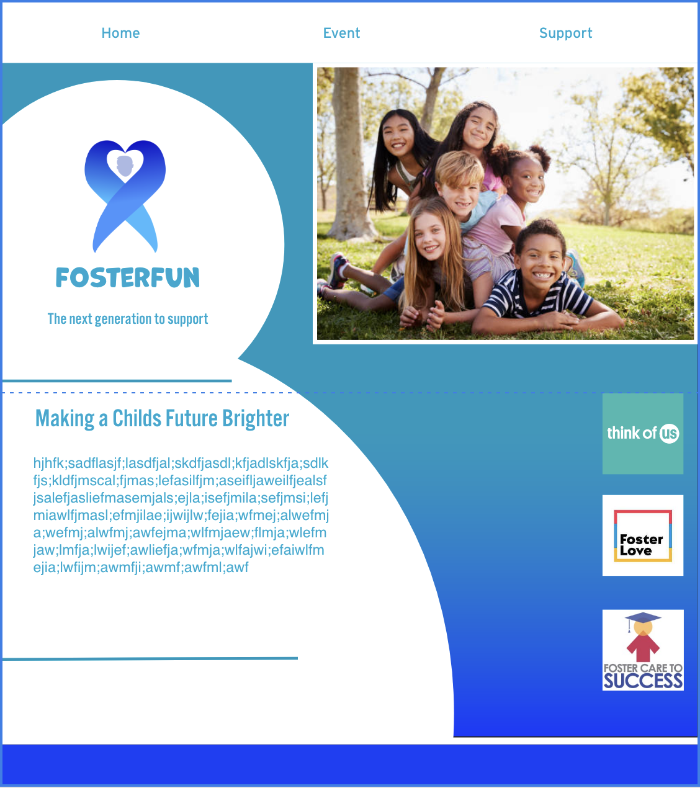
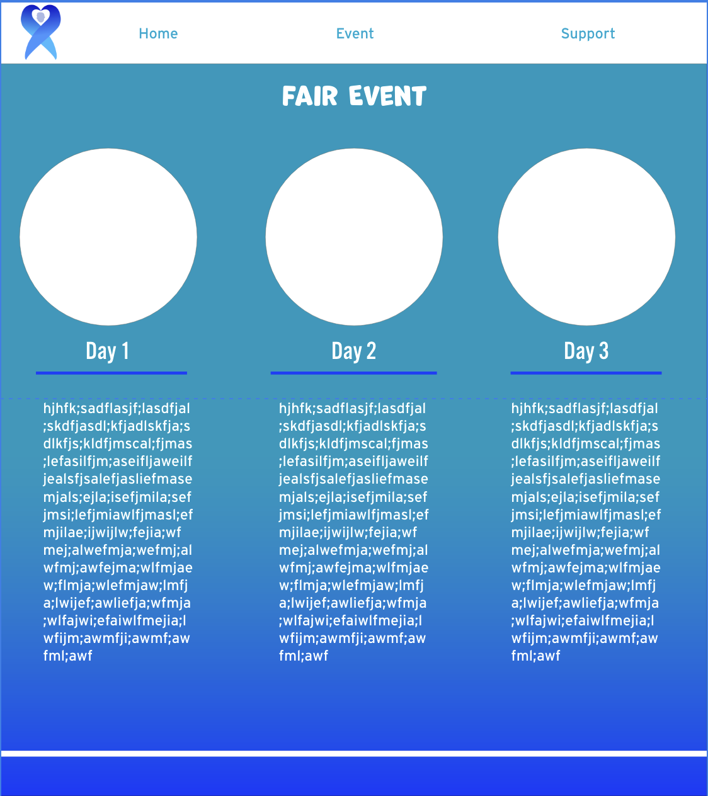

# Project 3

by Eduardo Salazar

11/13/23

# project overview:

Foster care lacks the support it needs, it's a significant resource that deserves a stronger support that impacts children's lives positively. Support like fundraisers change the aspects of people's lives and organizations for the better. Other methods such as resources can also spread awareness  and have been effective in supporting these organizations. Organizations like the homeless schools, the mentally ill, hospitals and churches have all contributed and benefited in these methods. As for foster carers the support is a bit lacking.  To contribute to the lack of attention of foster homes a desire of awareness will highlight the issue in full support in contributing to fundraisers for those in need.

To highlight why this is an issue research has been done to find a way to contribute to this cause. Many organizations come up with various ways of fundraisers by a donation box, local restaurant partnership and crowdfunding campaigns. For this event a supporting a fundraiser for foster carers and an event of a local fair would take place. A local fair and children are a great balance of showing your support, this a fun interactive way that can generate thousands of people to partake. The attention of children will grant a big success to a successful fundraiser. In addition the following events will include a letter/art event and a donation day. These will be a free entry event, this generate more people to come in an contribute in the suppport. Lastly. merchandise will be also inlcuded to generate awarnesss and support for the foster cares. These events and 

In this project an event will take place to contribute in the support of foster cares. What the event will be called FosterFun, a fair that will be held in The San Mateo County Event Center. This will generate an interaction and sense of joy that will be a fun way to support. The fair event will host a 3 day event, the first day will be a grand opening of fair games and rides on Dec 8th. Games and rides will draw the attention of kids and adults. Giving the excitement to want to contribute to this cause of helping the foster cares, yet having fun at the sametime. The event will offer tickets as a way of entry. With the amount of tickets being purchased it will generate an amount of money for the fundraisers as a head start. Another form of support will be on the 2nd Day Dec 8th. This day will be the chance to spread awareness that adults and kids will get the chance to interact with the foster kids in the form of writing letters and creating art. Writing letters will be a form interacting with foster children giving them the attention and support they need. Art will bring creativity as form of support, visual forms tend to lean on to kids as gives them a sense that these are also other kids that are supporting them. For the third day it would be a donation day a chance to donate small gifts to the foster kids. This could be anything to from clothes, toys and other resources that they want to give out. On the closing event foster kids will come and meet and greet the people who donated to them on that same day. them. These 5 events will support and spread awareness to foster children as this will be an opportunity to benefit them in many ways. Each day will contribute to the cause giving a chance to acknowledge what these events are for and for who.

The audience of who will be attending will be mainly children and parents. An event like this the majority of people will be children of all ages as the fair is an event that brings joy and interactions with many others. Children will have the chance to help the foster kids from just purchasing a ticket and attending. Children can partake in the festivities of the festival while simultaneously contributing to the fundraisers. it will generate an amount of attention highlighting what the event is about. The attention will reach schools, churches and clubs as a way of promoting the event, children can have fun at the festival and support at the same time with the fundraisers. Another target group will be parents as they will be better informed of an event that is going on in their local area, getting the chance to spend time with their children yet informing them what the event is about. With the announcements and who are attending this will spread awareness, they are contributing and spreading the word by giving the attention that this is a fundraiser for foster children. 

# technical overview:

75 % of this project is completed. A logo exploration, moodboard, color, pattern and typography were done as part of the process to explore ideas on the direction it was heading to. All of the explorations were created in adobe illustrator. The research that was gathered gave information about the organization that I'm supporting. 3 sets of logos were created implementing a meaning and clear representation of a foster care. The colors are a blue and a yellow as a correlation to what the colors represent foster children. These colors were ultimately used in the wireframes. Typography implemented a number of fonts, for the logo adobe fonts "Chaloops" was used for the logo. As for the web page Adobe fonts "Alternate Gothic No3 D", "Interstate" and "Marvin" round where used for the info, titles and nav bars. Patterns were created using the gradient as potential use for the wireframes. The wireframes were created in Adobe XD, which gave a potential website design that will catch the viewer's eye giving a sense of what this website is about. The wireframe will be used as part of a reference and implemented in our coding.The wireframe was revised from feedback and a new wireframe was set to go further in the next step. The software that will be used to create project 3 is visual studio code. 3 htmls and 1 css were created each having their own designated folder as part of this organization. Github will be our code hosting platform, Github link is ready and set. The layout of this project is to have the user interact and have a nav bar that links to the 2 other html pages. The Code that is used to create all the selections, will be h1-h6 tags, p , ul, nav and li tags. These selections will contribute to the aspects of the website. Such as color, fonts, navigations, spacing, adjusting images. To create the navigation bar the use of the navigation tag will construct the navigation bar, which consists of a white background with an inline format to establish that the navigation bars were aligned on a single line. To reset everything a margin: 0; padding: 0, box-sizing: border-box. Img will be used to set my images in my home page, event page and support page. An imagebackground was created for each 3 page these were all created in photoshop. For the background only one is placed as the other backgrounds are having difficulty. For the home page id and classes were used to create the page. H1 and p tags were used to align the information shifting them to the left. The way this was created was using css, text-align: left, align-items: left and float: left. This aligned my information and logo to the left as other elements were added such as the line-height: 25px and margin-left: -155px. For my images the img class was set up to clearly control the direction the photo was going to be placed at. Images in the home page were created using the div and were then adjusted in the css using  HomeChildren img: width: 700px; float: right; border: 5px solid #ffffff. The logo was set #FosterOr: width: 350px; float: right; margin-right: 100px and still implementing a div to adjust them. The images such as the different organizations were created in photoshop and as well as the Event images. A div class was created for the image of the different foster care organizations in the css the div class had width: 350px; float: right margin-right: 100px. The event page includes a parent and child and the same elements as the home page but flex boxes were used to create 3 columns. The 3 columns separate the different dates. h2 and h3 are used for dates and titles. img was used to display the event tickets, and was used to separate the title " Buy Tickets. from the ticket image. The implements that were used for the ticket image is  width: 350px; float: right; margin-right: 100px; in the css. For the support page id and class was used to create this page. The page is presented as a page where you can merchandise. Small description gives information about the page itself. The float: right; display: flex and flex-wrap: wrap were used in this procedure. In addition for the support page merch was created in photoshop creating a variety of different merchandise including hats, hoodies and mugs. These were then implemented in support html and were then contained in a div class called "merch row" as the images were intended to be set in a row. Another div class was used for each individual image which was named column. Css was used to shift them around the div column had a  float: left; width: 22%; padding: 5px;. As for the “merchrow”, it had a  display: table  clear: both. As of now the website needs to fix some minor issues.
 

# XD WireFrame Images:

# XD WireFrame Link:

https://xd.adobe.com/view/c759286b-e180-4eff-bb82-a0f238fab7a0-920a/ 

# acknowledgment

fonts:

https://fonts.adobe.com/search?query=Chaloops

https://fonts.adobe.com/fonts/interstate

https://fonts.adobe.com/search?query=Alternate+Gothic+No3+D

https://fonts.adobe.com/fonts/marvin

Stock Images placeholders:

https://www.istockphoto.com/photos/children

https://www.istockphoto.com/photo/child-and-parent-hands-holding-money-jar-donation-saving-charity-family-finance-plan-gm1216694114-354881104?phrase=charity+money&searchscope=image%2Cfilm 

https://www.thinkofus.org/

https://images.app.goo.gl/DGPqrMQXxqo2XN537 

https://images.app.goo.gl/wYy6aJby2pRYqejq9

https://images.app.goo.gl/E7SmSGXQgwe9Xv7o9

h

